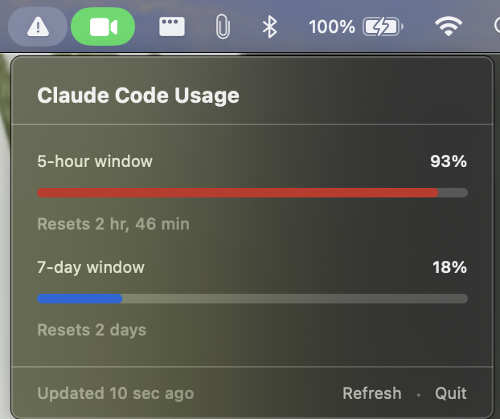

# CCUsageBar

[](https://github.com/jatinsmu/cc-usage-tracker-menu-bar/actions/workflows/ci.yml)

A lightweight macOS menu bar app that shows your [Claude Code](https://claude.ai/code) quota in real time — no more opening the Claude desktop app and clicking Refresh.

## Screenshot



*The ▲ icon in the menu bar indicates critical usage. The popover shows the current utilisation for both windows, how long until each resets, and a Refresh button.*

## Features

- Live 5-hour and 7-day quota utilisation in the menu bar
- Severity glyph changes automatically: `⊙` (normal) → `⊙` (warning) → `▲` (critical)
- Progress bars with colour coding — blue → orange → red
- Countdown timers showing exactly when each window resets
- Auto-polls every 15 minutes; Refresh button for an instant update
- Graceful degradation: shows last known values when offline, explains expired tokens
- No Dock icon, no background processes beyond the polling timer

## Requirements

- **macOS 13 (Ventura) or later**
- **Xcode Command Line Tools** — install with `xcode-select --install` if you haven't already
- **Claude Code** installed and signed in (the app reads your session from the macOS Keychain automatically)

## Install

**Build from source — there's no prebuilt download, by design.** The build script
mints a self-signed code-signing identity *on your machine* and signs the app with it.
That local identity is what keeps the Claude Code Keychain ACL valid across rebuilds (one
"Always Allow" and you're done), and building locally avoids the Gatekeeper quarantine a
downloaded binary would carry. [Releases](https://github.com/jatinsmu/cc-usage-tracker-menu-bar/releases)
are source snapshots — clone or grab one, then run the script below.

```bash
git clone https://github.com/jatinsmu/cc-usage-tracker-menu-bar.git
cd cc-usage-tracker-menu-bar
bash scripts/build-app.sh
```

The script will:
1. Create a stable self-signed code-signing identity in your login Keychain (one-time setup; macOS may show an authorisation dialog)
2. Compile the Swift sources
3. Assemble `CCUsageBar.app` in the repo root
4. Codesign it with that identity

Then launch:

```bash
open CCUsageBar.app
```

To have it start at login, right-click the app in Finder → **Open With** → **Login Items**, or drag it to **System Settings → General → Login Items**.

### Gatekeeper on first launch

Because this app is signed with a personal self-signed certificate (not an Apple Developer ID), macOS will block the very first launch:

> *"CCUsageBar" cannot be opened because the developer cannot be verified.*

**Right-click (or Control-click) the app → Open → Open.** You only need to do this once per machine.

Alternatively:

```bash
xattr -dr com.apple.quarantine CCUsageBar.app
open CCUsageBar.app
```

### Keychain access prompt

The first time CCUsageBar reads your Claude Code session token, macOS will ask:

> *"CCUsageBar" wants to use confidential information stored in "Claude Code-credentials" in your keychain.*

Click **Always Allow**. After that, the app reads the token silently on every poll — no further prompts, even after a rebuild (the stable self-signed identity keeps the ACL entry valid).

## Updating

```bash
git pull
pkill CCUsageBar          # quit the running instance
bash scripts/build-app.sh
open CCUsageBar.app
```

## Menu bar states

| Icon | Label | Meaning |
|------|-------|---------|
| `⊙` | `23%` | Session at 23% — plenty of headroom |
| `⊙` | `67%` | Warning severity |
| `▲` | `93%` | Critical — approaching the session limit |
| `⊙` | `--` *(dimmed)* | Offline; last known value shown |
| `▲` | `!` | Token expired — open Claude Code to refresh |
| `⊙` | `?` | Claude Code not installed or not signed in |

## Privacy & security

| What | Detail |
|------|--------|
| **Token storage** | Never written to disk by this app — read-only from the system Keychain |
| **Token in memory** | Used for one API request per poll cycle, then discarded |
| **No logging** | Token and usage data are never written to log files |
| **Network** | HTTPS only; standard macOS certificate validation |
| **Keychain read** | Run off the main thread so a Keychain dialog never freezes the UI |
| **Sandboxing** | The app is *not* sandboxed (required to read a Keychain item created by Claude Code and to connect to api.anthropic.com) |

The only outbound connection is to `api.anthropic.com` — the same endpoint the Claude desktop app uses. The app reads the Keychain item created by Claude Code; it cannot modify it.

## How it works

1. Reads your OAuth access token from the macOS Keychain item `"Claude Code-credentials"` that Claude Code maintains (via the Security framework — not the `security` CLI, which would bind the ACL to Apple's binary instead of this app).
2. GETs `https://api.anthropic.com/api/oauth/usage` with `Authorization: Bearer <token>` and `anthropic-beta: oauth-2025-04-20`.
3. Decodes the response into utilisation percentages and reset times.
4. Updates the menu bar label and popover every 15 minutes (or immediately on Refresh).

## Troubleshooting

**Stuck on "Offline"**
- Click **Retry** in the popover and watch for a Keychain dialog behind another window.
- Open **Keychain Access** → search `Claude Code-credentials` → **Access Control** tab → verify CCUsageBar is listed.
- Check your internet connection — the app connects to `api.anthropic.com`.

**"Session expired" / "Unauthorized"**
- Open Claude Code and use it briefly — it refreshes the OAuth token automatically.

**"Not connected"**
- Claude Code must be installed and signed in at least once. The Keychain item is created on first sign-in.

**App doesn't appear in the menu bar**
- Run `pgrep CCUsageBar` — if no PID, the build may have failed. Re-run `bash scripts/build-app.sh` and check for errors.
- If the menu bar is crowded, macOS hides overflow items — try closing some other menu bar apps.

## Source layout

```
Sources/CCUsageBar/
  CCUsageBarApp.swift      — @main App, MenuBarExtra wired to UsageViewModel
  KeychainReader.swift     — SecItemCopyMatching → ClaudeCredentials
  UsageClient.swift        — async GET /api/oauth/usage → UsageSnapshot
  Models.swift             — UsageSnapshot, UsageWindow, UsageLimit, Severity
  QuotaMetrics.swift       — pure pace/percent math for the quota windows
  UsageViewModel.swift     — @MainActor ObservableObject; 15-min poll loop
  Views/
    PopoverView.swift      — state-driven popover
    QuotaTrackView.swift   — the quota track with the pace marker
    Theme.swift            — accent palette (coral → ochre → clay)
Tests/CCUsageBarTests/     — XCTest suite for the pure logic
Resources/Info.plist       — LSUIElement=true, bundle identifier
scripts/build-app.sh       — compile → assemble .app → codesign
.github/workflows/ci.yml   — build + test on every PR/push to main
```

## Development

Run the test suite:

```bash
swift test
```

> `swift test` and `swift build` require a **full Xcode** install — they need the macOS platform SDK that the Command Line Tools alone don't provide. With CLT only, use `scripts/build-app.sh` to build the app, and let CI run the tests.

The tests are plain XCTest and cover the pure logic — API and Keychain JSON decoding, severity rules, quota pace math, ISO-8601 date parsing, and the menu-bar label/symbol for each app state. They perform no network or Keychain access.

CI (`.github/workflows/ci.yml`) runs on every pull request to `main` and every push to `main`:

1. `swift build` — validates the package manifest and compiles every target
2. `swift test` — runs the suite
3. `CCUSAGEBAR_SKIP_SIGN=1 bash scripts/build-app.sh` — verifies the real distribution build compiles and assembles (codesign skipped on the runner)

**Enforcing it (one-time GitHub setup):** CI runs automatically, but only *blocks* a merge once you require it. In **Settings → Branches** for `main`, add a rule that enables **Require a pull request before merging** and **Require status checks to pass**, then select the **Build & Test** check. After that, nothing merges to `main` until CI is green.

## Contributing

Pull requests welcome. A few notes:

- The endpoint (`/api/oauth/usage` + `anthropic-beta: oauth-2025-04-20`) is an internal Anthropic API that can change without notice. The app degrades gracefully if it breaks.
- Please open an issue before starting large changes so we can discuss the approach.
- The build requires only the macOS Command Line Tools — no Xcode needed.

## License

MIT — see [LICENSE](LICENSE).
